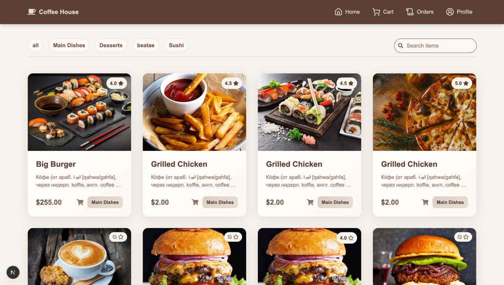
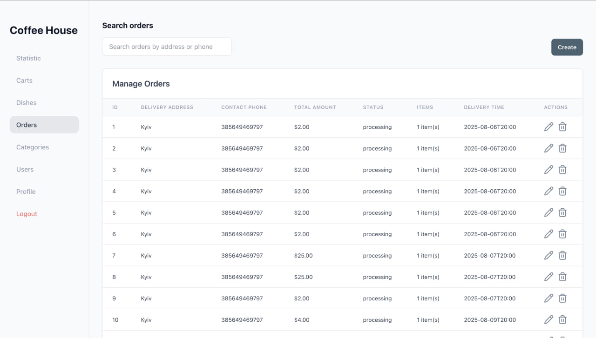

# Coffee House ☕

Welcome to **Coffee House** - online platform for ordering your favorite coffee and snacks from the comfort of your home!

## Screenshots



## Features
- Browse a wide variety of coffee and snack options.
- Customize your coffee with different flavors, sizes, and add-ons.
- Easy and secure online payment options.
- Track your order in real-time.
- User-friendly interface for a seamless experience.

## Installation
1. Clone the repository:
    ```bash
    git clone https://github.com/theromadevua/coffee_house
    ```
2. Navigate to the project directory:
    ```bash
    cd coffee_house
    ```
3. Install dependencies:
    ```bash
    npm install
    ```
4. Start the development server:
    ```bash
    npm start
    ```

## Technologies Used
- **Frontend**: React
- **Backend**: Laravel
- **Database**: MySql
- **Microservice**: Nest.js
- **Payment Integration**: PayPal

Enjoy your coffee! ☕
